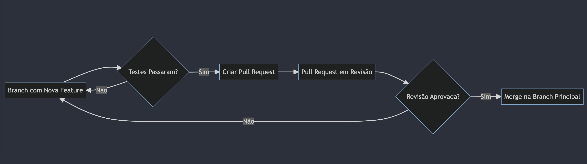

# Trabalhando com Múltiplas Branches e Pull Requests no GitHub

## Introdução

Trabalhar com múltiplas branches permite que você isole mudanças específicas em um ambiente seguro, sem afetar o restante do projeto. Depois que as alterações estiverem prontas e testadas, você pode solicitar um Pull Request para incorporá-las na branch principal do projeto.

Aqui estão os passos básicos para trabalhar com múltiplas branches e pull requests:

## Criando uma nova branch

1. No GitHub Desktop, clique em "Current branch" -> "New branch" e digite o nome da nova branch.
2. Agora, você está na nova branch e pode começar a trabalhar na nova feature ou bugfix.

## Criando um Pull Request

1. Após ter feito commit de todas as suas alterações na nova branch, clique em "Create Pull Request" no GitHub Desktop.
2. Isso abrirá o GitHub no seu navegador de internet, onde você poderá preencher os detalhes do Pull Request.
3. Após preencher os detalhes, clique em "Create pull request".

## Revisando e fazendo o Merge do Pull Request

1. Outro membro da equipe irá revisar suas alterações e sugerir quaisquer melhorias necessárias.
2. Se as alterações forem aprovadas, o revisor fará o merge das suas alterações na branch principal.
3. Se as alterações não forem aprovadas, você precisará fazer as alterações sugeridas e submeter o Pull Request novamente.
